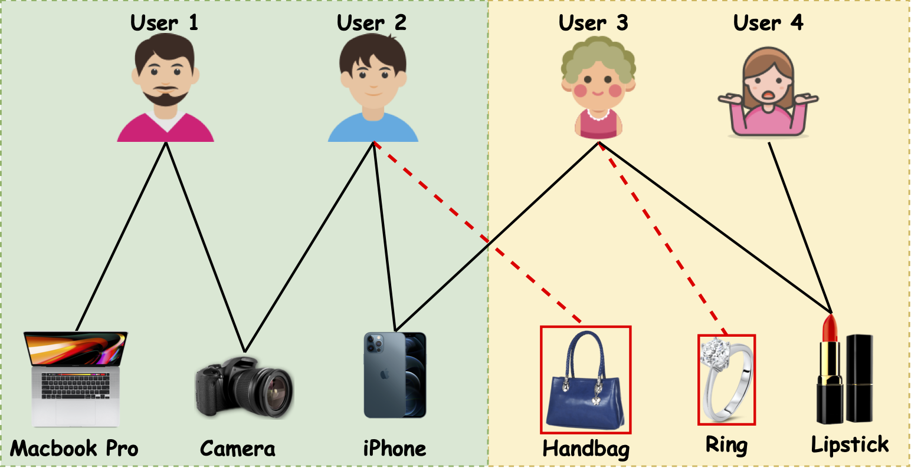

# GTN-pytorch

## GTN: Graph Trend Filtering Networks for Recommendations
Pytorch Implementation of GTN in Graph Trend Networks for Recommendations


[**<u>Wenqi Fan</u>**](https://wenqifan03.github.io), [Xiaorui Liu](http://cse.msu.edu/~xiaorui/), [Wei Jin](http://cse.msu.edu/~jinwei2/), [Xiangyu Zhao](https://zhaoxyai.github.io), [Jiliang Tang](http://www.cse.msu.edu/~tangjili/), and Qing Li. [Graph Trend Filtering Networks for Recommendations](https://arxiv.org/pdf/2108.05552.pdf), Accepted by SIGIR'2022. Preprint PDF[https://arxiv.org/pdf/2108.05552.pdf]


The original version of this code base was from LightGCN-pytorch: https://github.com/gusye1234/LightGCN-PyTorch 
Many thanks to Prof. He's group for making LightGCN code available.


## Abstract
Recommender systems aim to provide personalized services to users and are playing an increasingly important role in our daily lives. The key of recommender systems is to predict how likely users will interact with items based on their historical online behaviors, e.g., clicks, add-to-cart, purchases, etc. To exploit these user-item interactions, there are increasing efforts on considering the user-item interactions as a user-item bipartite graph and then performing information propagation in the graph via Graph Neural Networks (GNNs). Given the power of GNNs in graph representation learning, these GNN-based recommendation methods have remarkably boosted the recommendation performance. Despite their success, most existing GNN-based recommender systems overlook the existence of interactions caused by unreliable behaviors (e.g., random/bait clicks) and uniformly treat all the interactions, which can lead to sub-optimal and unstable performance. In this paper, we investigate the drawbacks (e.g., non-adaptive propagation and non-robustness) of existing GNN-based recommendation methods. To address these drawbacks, we propose the Graph Trend Networks for recommendations (GTN) with principled designs that can capture the adaptive reliability of the interactions. Comprehensive experiments and ablation studies are presented to verify and understand the effectiveness of the proposed framework.



An illustration on unreliable user-item interactions. User 2 bought a one-time item (i.e., Handbag) for his mother’s birthday present; User 3 was affected by the click-bait issue and was ‘cheated’ to interact with an item (i.e., Ring) by the attractive exposure features (e.g., headline or cover of the item).

## Requirement
* PyTorch Geometric
* torch==1.4.0
* pandas==0.24.2
* scipy==1.3.0
* numpy==1.16.4
* tensorboardX==1.8
* scikit-learn==0.23.2
* tqdm==4.48.2


## Examples
Run GTN:

```
$ cd code
$ python run_main.py --dataset 'gowalla' --lambda2 4.0
```
 


## BibTeX
If you use this code, please cite our paper:


```
@inproceedings{fan2022graph,
  title={Graph Trend Filtering Networks for Recommendations},
  author={Fan, Wenqi and Liu, Xiaorui and Jin, Wei and Zhao, Xiangyu and Tang, Jiliang and Li, Qing},
  booktitle={International ACM SIGIR Conference on Research and Development in Information Retrieval (SIGIR)},
  year={2022}
}
```

